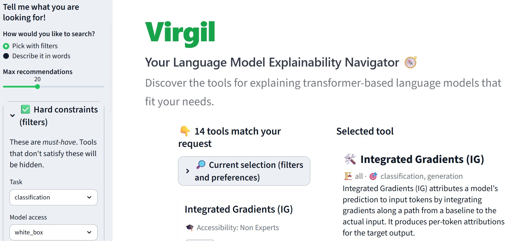

<p align="center">
  
</p>

<h1 align="center">Virgil</h1>
<p align="center">
  <strong>Your Language Model Explainability Navigator</strong>
</p>

<p align="center">
  Discover, compare, and run explainability methods for transformer-based language models.
</p>

<p align="center">
  
  
  
</p>


---

## Overview

> There are many explainability tools for language models, but it is often unclear  
> which method fits a specific need, what level of expertise it requires,  
> and how to actually run it in practice.


**Virgil** is an interactive interface for **explainable AI for transformer-based language models**.

It is designed to help practitioners and researchers, regardless of their level of expertise, to:
- discover suitable explainability methods for their needs,
- easily access the salient characteristics of the different methods, 
- compare methods side by side,
- run selected methods through a unified interface.
---


## Try Virgil Online

You can try Virgil directly in your browser via Hugging Face Spaces:

[](https://huggingface.co/spaces/XAI4LLMs/Virgil)

---


<p align="center">
  
</p>

---

## Libraries and projects used

Virgil builds on top of several excellent open-source resources. :contentReference[oaicite:1]{index=1}

- [Captum](https://captum.ai/) — explainability for PyTorch
- [BertViz](https://github.com/jessevig/bertviz) — attention visualization
- [Alibi](https://alibi.readthedocs.io/en/latest/) — miscellaneous explanation methods
- [Inseq](https://inseq.org/) — explainability for text generation
- [SAELens](https://github.com/decoderesearch/SAELens) — sparse autoencoder analysis
- [Neuronpedia](https://github.com/hijohnnylin/neuronpedia) — feature dashboards and interpretability tooling
- [Ecco](https://github.com/jalammar/ecco) — explanation methods for transformer-based language models 
- [TransformerLens](https://github.com/TransformerLensOrg/TransformerLens) — mechanistic interpretability for transformer-based language models
- [LLM Transparency Tool](https://github.com/facebookresearch/llm-transparency-tool) - analyze transformer computational graph 

---

## Installation
Virgil requires **two separate Python environments** to manage dependency conflicts.

### 1. Clone the repository

```bash
git clone https://github.com/maciap/Virgil.git
cd Virgil
```

### 2. Create the environments

Virgil was tested with **Python 3.12**.

```bash
conda create -n virgil-main python=3.12.10 -y
conda create -n virgil-inseq python=3.12.10 -y
```

### 3. Install dependencies

Install the main application dependencies:

```bash
conda activate virgil-main
pip install -r requirements_fix.txt
```

Install the dependencies required for generation-based explainability methods:

```bash
conda activate virgil-inseq
pip install -r xai-inseq-requirements.txt
```

---

## Running Virgil

Virgil runs two services simultaneously:

- **Inseq API service** (generation explainability backend)
- **Streamlit interface** (main application)

### 1. Start the Inseq service

In a terminal:

```bash
conda activate virgil-inseq
python -m uvicorn inseq_service.app:app --host 0.0.0.0 --port 8001 --log-level info
```

### 2. Start the Streamlit interface

Open a second terminal and run:

```bash
conda activate virgil-main
streamlit run Navigator.py
```

### 3. Open the application

Will open automatically, or go to: 
```
http://localhost:8501
```

The Virgil interface should now be available locally.

#### Notes

- The Inseq backend runs on **port 8001**.
- The Streamlit interface runs on **port 8501**.
- Both services must be running simultaneously for everything to function properly.

---

